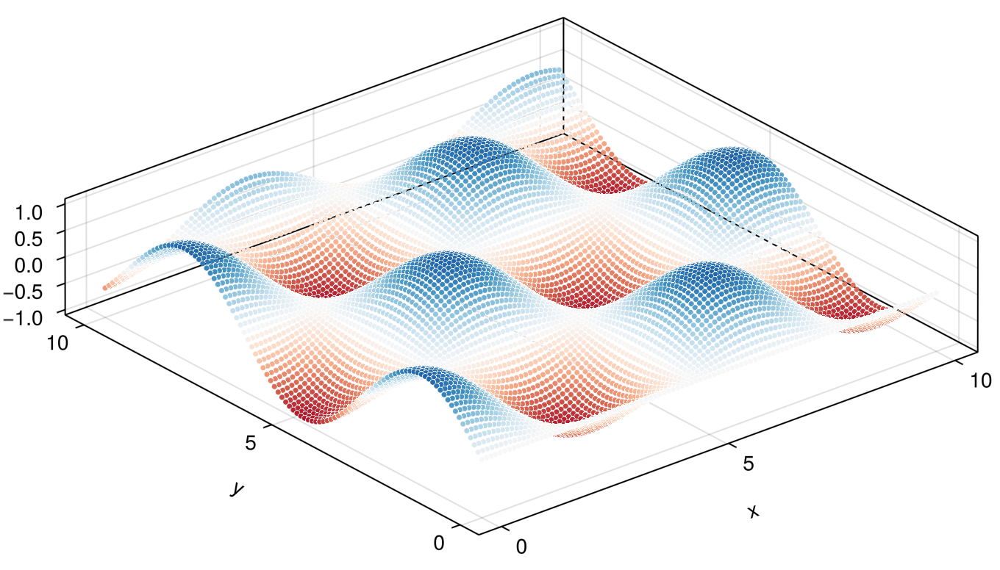
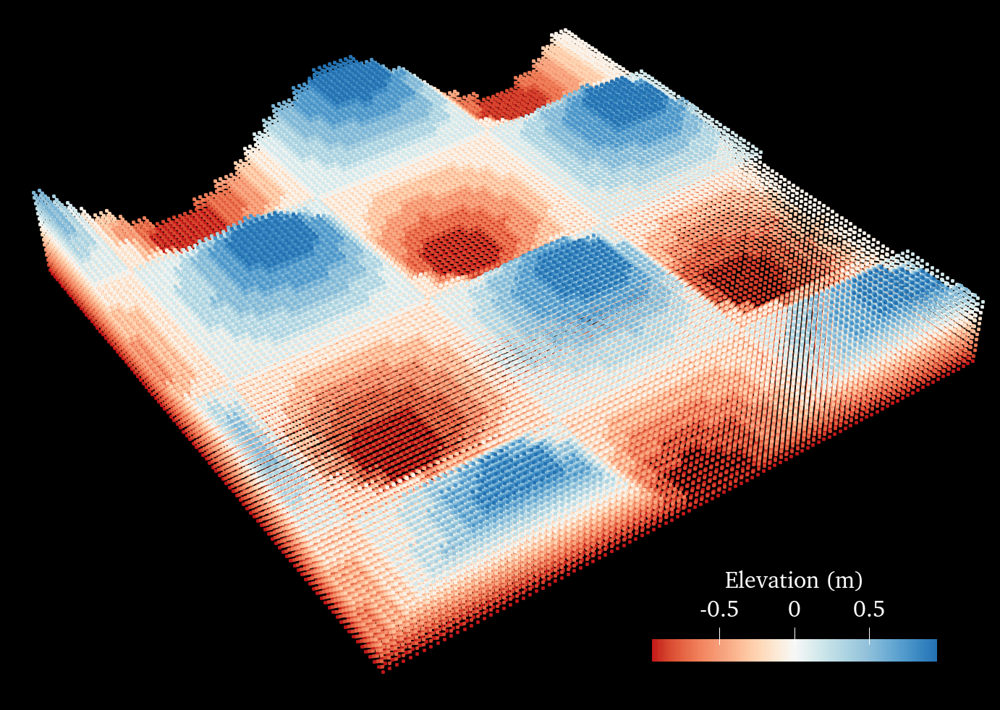
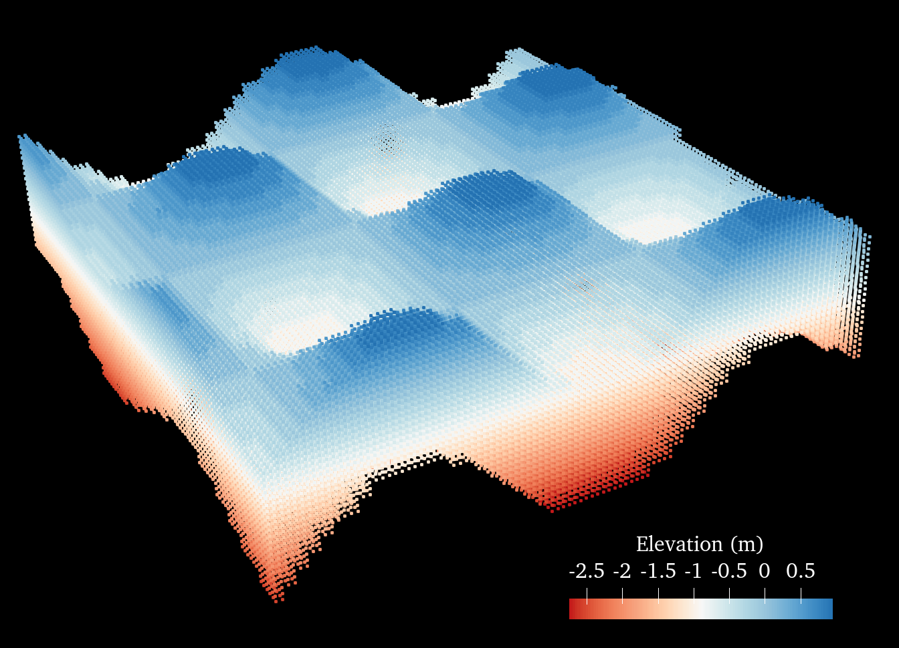
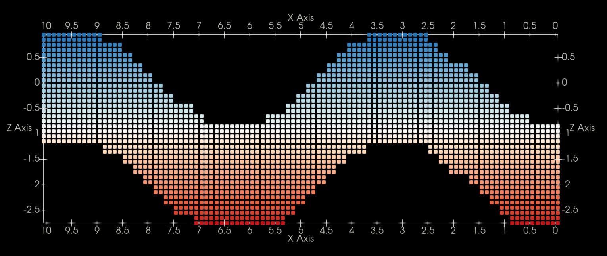

# DEM

Here we use a function to generate a DEM sample file:

```julia
using MaterialPointGenerator

xy = meshbuilder(0:0.1:10, 0:0.1:10)
z = @. cos(xy[:, 1]) * sin(xy[:, 2])
data = [xy z]
```

We can visualize `data` and obtain:



## Fill to the plane

```julia
h = 0.2
bottom = -1.0

dem_0 = DEMSurface(data)
dem_1 = rasterizeDEM(dem_0, h)
dem_1 = DEMSurface(dem_1)

pts = dem2particle(dem_1, h, bottom)
```



## Fill to another DEM

```julia
h = 0.2

dem_0 = DEMSurface(data)
dem_1 = rasterizeDEM(dem_0, h)
dem_2 = copy(dem_1)
dem_2[:, 3] .-= 2

dem_t = DEMSurface(dem_1)
dem_b = DEMSurface(dem_2)

pts = dem2particle(dem_t, h, dem_b)
```



