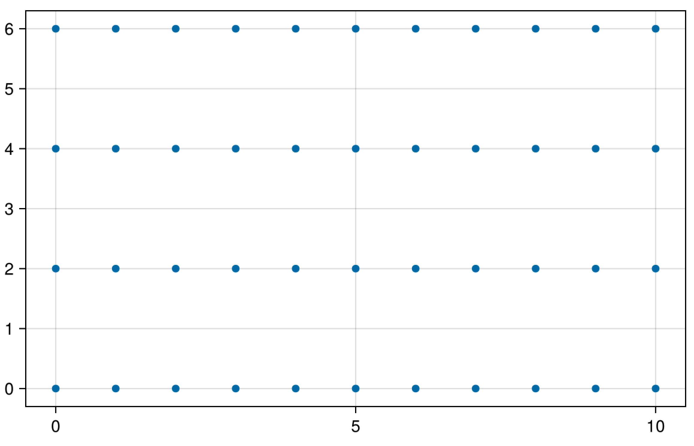
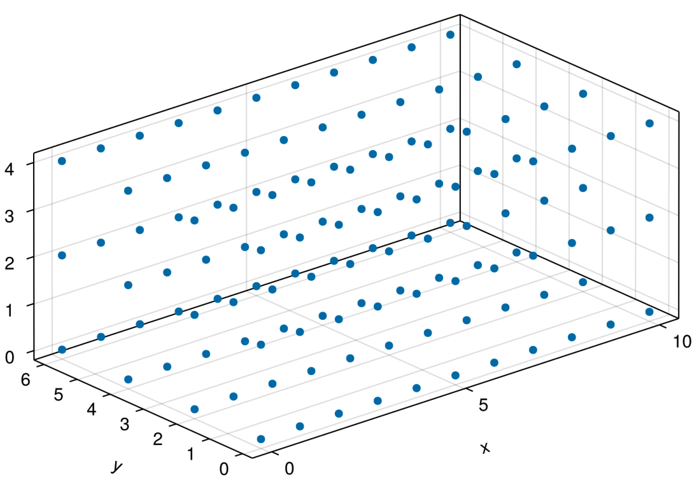

# Simple Mesh

Here, we consider generating rectangular domain nodes (2D) and cuboidal domain nodes (3D) by controlling the starting range and step size in each direction.

## 2D

Consider a rectangular area where the range in the x-direction is from 0 to 10 and in the 
y-direction from 0 to 6. The step size in the x-direction is 1, and in the y-direction, it 
is 2. Therefore, we can do:

```@docs
meshbuilder(x::T, y::T; ϵ::String="FP64") where T <: AbstractRange
```

```julia
julia> pts = meshbuilder(0.0 : 1.0 : 10.0, 0.0: 2.0 : 6.0)
44×2 Matrix{Float64}:
  0.0  0.0
  0.0  2.0
  0.0  4.0
  0.0  6.0
  1.0  0.0
  1.0  2.0
  ⋮    
  9.0  6.0
 10.0  0.0
 10.0  2.0
 10.0  4.0
 10.0  6.0
```

This way, we can obtain the results shown in the figure. The variable `pts` is an array 
where the first column contains the x-coordinates of all the nodes, and the second column 
contains the corresponding y-coordinates.



## 3D

Similarly, we can use this function to generate a set of points in three-dimensional space.

```@docs
meshbuilder(x::T, y::T, z::T; ϵ::String="FP64") where T <: AbstractRange
```

```julia
julia> pts = meshbuilder(0.0 : 1.0 : 10.0, 0.0: 2.0 : 6.0, 0.0 : 2.0 : 4.0)
132×3 Matrix{Float64}:
  0.0  0.0  0.0
  0.0  2.0  0.0
  0.0  4.0  0.0
  0.0  6.0  0.0
  1.0  0.0  0.0
  1.0  2.0  0.0
  ⋮         
  9.0  6.0  4.0
 10.0  0.0  4.0
 10.0  2.0  4.0
 10.0  4.0  4.0
 10.0  6.0  4.0
```



## Export

For two-dimensional points and three-dimensional points, you can use the functions `savexy` and `savexyz` to save them as `.xy` and `.xyz` files, respectively. You can also use `readxy` and `readxyz` to read these files.

```@docs
savexy(file_dir::P, pts::T) where {P <: String, T <: AbstractMatrix}
savexyz(file_dir::P, pts::T) where {P <: String, T <: AbstractMatrix}
readxy(file_dir::P) where P <: String
readxyz(file_dir::P) where P <: String
```

```julia
output_file = joinpath(@__DIR__, "test.xyz")
savexyz(output_file, pts)
data = readxyz(output_file)
```